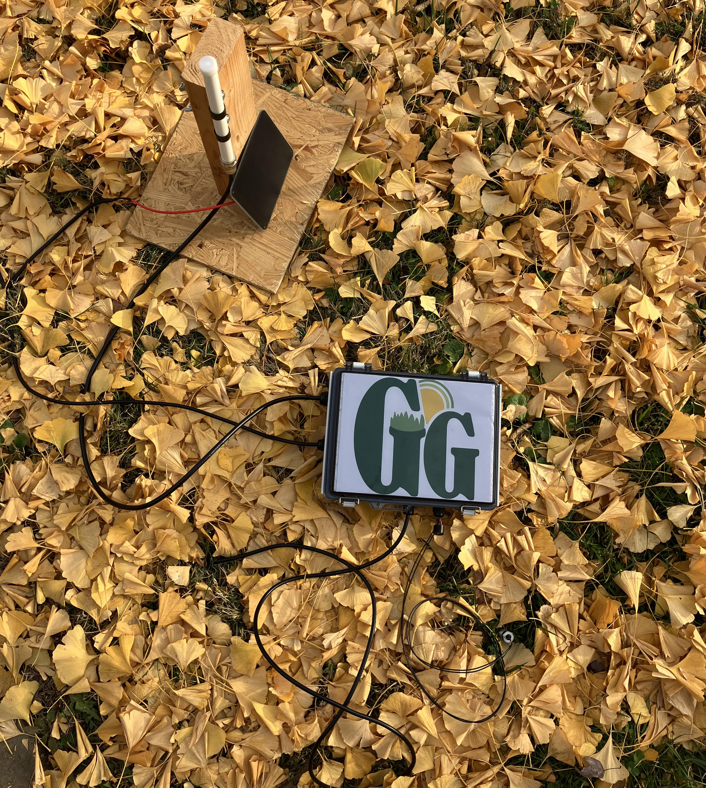

# Garden Guard
ECE 4440 Capstone Design, Fall 2025
 Department of Electrical and Computer Engineering at the University of Virginia

# Team Members 
Tessa Heick, Rowland Halsey Robinson, and Kayla Sprincis

# Project Overview
Have you ever had your plants eaten by rabbits, deer, or other cute but destructive creatures? Garden Guard works as a vigilant defender of your plants, scaring animals with a deterring sound upon detection around the clock. With a focus on low-cost, low-maintenance design, the outdoor system leverages solar energy to improve gardening workflow with animal sighting and soil metrics transmitted right to your home. 

Garden Guard consists of two deliverable devices: a system that will be placed in a remote garden that assesses soil conditions and responds to animal detection, and a system placed in the home that receives transmissions from the primary system and provides a user interface displaying garden data. Targeted towards gardeners with outdoor plants, it caters to those with more remote setups, reducing the workload of check-ins.

# File Descriptions
* indoorDevice.ino - Embedded code for indoor device
* outdoorDevice.ino - Embedded code for outdoor device
* UI_gardenguard.zip - Zip file containing our UI application, which is a Godot project 
* UI_Export.zip - Zip file containing the executable for our UI

